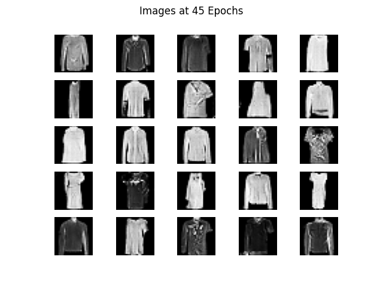

# Overview

This repo contains a Colab Notebook of a Deep Convolutional Generative Adversarial Networks (DCGAN) being used for generating images from the MNIST and Fashion MNIST datasets.

**Note:** this notebook is meant to be run in Google Colab.

# Results:

Here are the results from the DCGAN at different epochs (see `gan_images/`):

 

 

 

 

 

 

 

 

